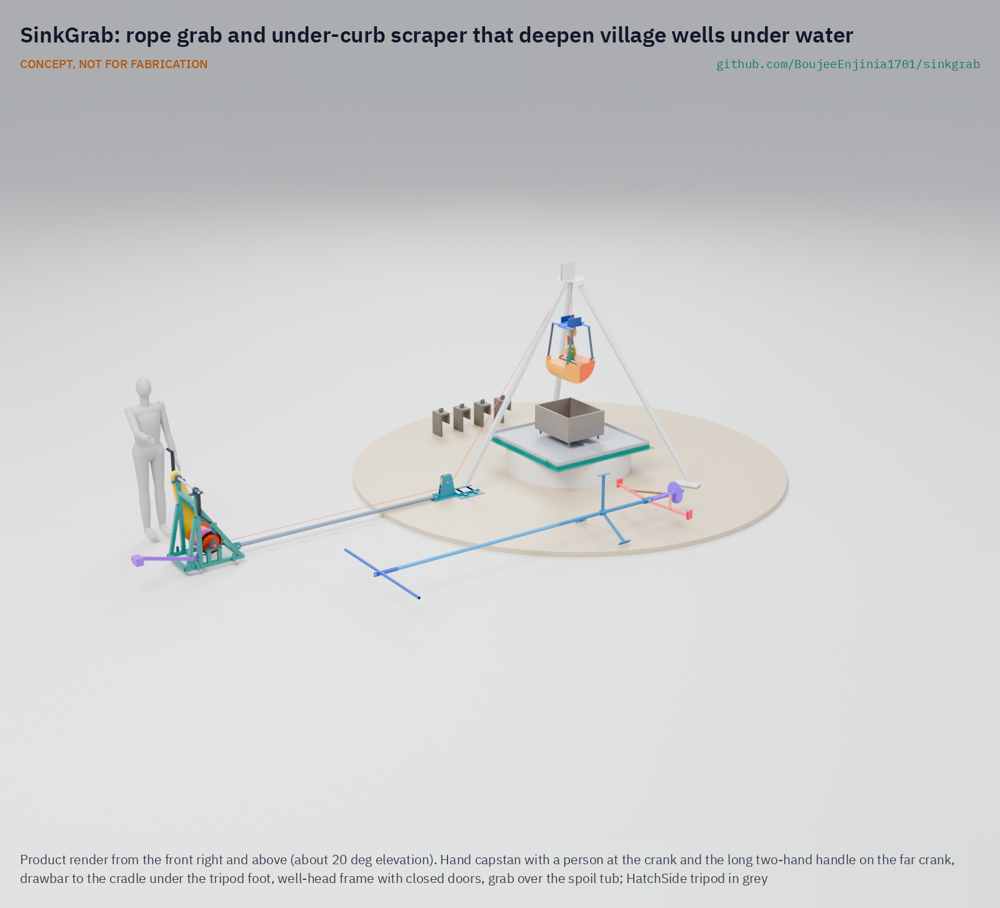
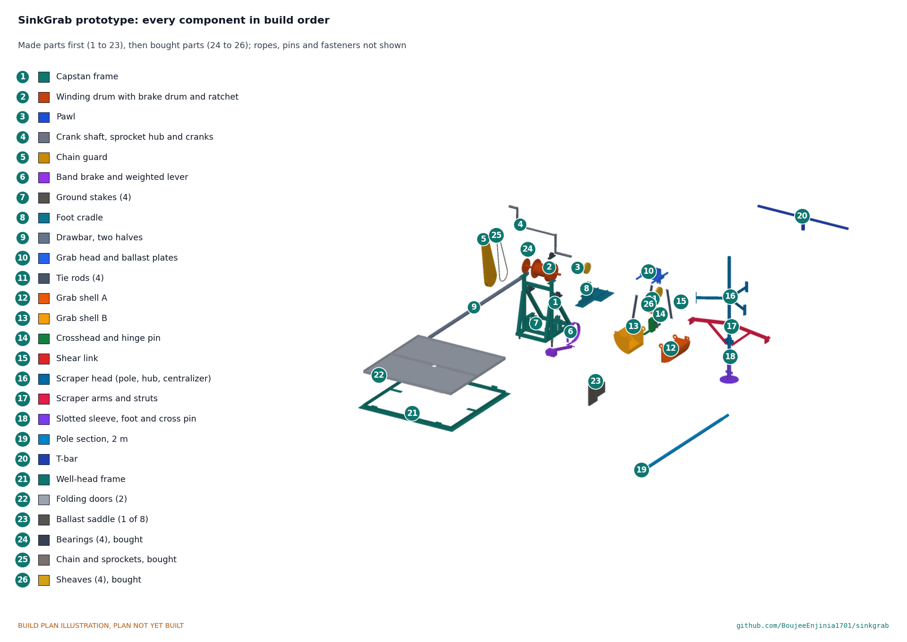

# SinkGrab

     

**Area:** Food and water security · **TRL:** 3 of 9 (proof of concept on paper; constructable design) · **Value-engineering target:** USD 4,000; estimated parts cost USD 2,566 · **Difficulty:** 3 of 5

Deepens village wells under water with a rope grab and under-curb scraper, without divers or pumps.

> CONCEPT, NOT FOR FABRICATION. SinkGrab is a TRL 3 design on paper: it has not been built or tested.

## Concept rationale

A hand-dug well only gives water all year if its intake sits well below the lowest seasonal water level. Guidance for caisson wells is to keep excavating and sinking rings typically 2 to 3 m below the water table ([Abbott, Hand Dug Wells manual](https://sswm.info/sites/default/files/reference_attachments/ABBOT%204000%20Hand%20Dug%20Well%20Manual.pdf)). Without de-watering the practical limit is about 1 m ([Akvopedia](https://akvopedia.org/wiki/Traditional_hand-dug_wells)). The usual answers are a motor pump to bail the well, or a person working under water. SinkGrab removes both: the digging and the undercutting are done by tools on ropes, worked from the surface.

SinkGrab is two tools and a routine. A rope-closed grab bites soil from the bottom of the flooded well inside the caisson rings and lifts it out. An under-curb scraper reaches under the cutting edge of the bottom ring so the lining sinks evenly as the soil is removed. Both hang from the HatchSide tripod and are worked with a hand capstan, so the crew stays at the top. Everything is built from steel section, rope and hand tools, and is published under open licences so village fabricators can copy and repair it.

## Burning platform

About 296 million people still drink from unprotected wells or springs ([Our World in Data, from WHO/UNICEF JMP 2024](https://ourworldindata.org/what-no-safe-water-means)). Many more rely on protected hand-dug wells that fail in the dry season: 'Hand-dug wells have a tendency to have very little water or even dry up in the dry season', largely because the intake is not deep enough below the seasonal water table, which can move several metres between seasons ([Akvopedia](https://akvopedia.org/wiki/Traditional_hand-dug_wells)). In Ethiopia's 2015/16 drought, hand-dug wells dried up while monitored boreholes kept the same flow all year, and people without boreholes queued for up to 10 hours for water ([BGS](https://www.bgs.ac.uk/news/study-shows-boreholes-are-key-to-drought-resilience-in-ethiopia/)).

Going deeper under water is dangerous. Oxfam's guidance says a diesel or petrol pump or its engine must never be lowered into a well, because carbon monoxide collects there ([Oxfam WASH](https://www.oxfamwash.org/repairing-cleaning-and-disinfecting-hand-dug-wells/)). In August 2023 three men died in Mutare, Zimbabwe, while draining a well about 19 m deep with a petrol pump ([ZimLive, 2023](https://www.zimlive.com/3-killed-in-carbon-monoxide-poisoning-after-turning-on-generator-in-a-well/)). In August 2026 four men died of suspected toxic gas while repairing a motor inside a well in Gaya Ji, Bihar ([The Tribune, 2026](https://www.tribuneindia.com/news/india/4-die-of-asphyxiation-after-inhaling-toxic-gas-inside-well-in-bihars-gaya-ji/)). Every hour a person spends at the bottom of a well is exposure; tools that dig from the surface cut that exposure.

## Where it could be used

### By industry

| Industry | Use |
| --- | --- |
| Rural water supply and WASH programmes | Deepening existing hand-dug wells so they last through the dry season |
| Well-digging contractors and village fabricators | A safer, pump-free way to finish the wet part of a new caisson well |
| Smallholder irrigation | Deepening dug wells used for garden and livestock water |
| Drought and humanitarian response | Rehabilitating dry community wells quickly with a kit that travels on a pickup |
| Small civil works | Sinking small precast caissons for pump sumps and soakaways |
| Engineering education | A documented case study in caisson sinking, rope mechanics and field safety |

### By country or region

| Country or region | Why it matters there |
| --- | --- |
| India (Kerala) | About 65% of rural and 59% of urban households depend on wells, and 48% of 45 lakh wells surveyed in 2003 dried up in summer ([SOPPECOM, citing Census 2011 and the Kerala Water Authority](https://www.soppecom.org/pdf/Groundwater-Resource-and-Governance-in-Kerala.pdf)). |
| India (Thiruvananthapuram) | Well diggers report that in summer they must dig an extra 10 to 15 feet (3 to 4.5 m) down, and one crew dug more than 70 wells in three months ([Deccan Chronicle, 2017](https://www.deccanchronicle.com/nation/in-other-news/040517/thiruvananthapuram-well-diggers-strike-gold-in-summer.html)). |
| Ethiopia | In the 2015/16 drought hand-dug wells dried up and many became grossly contaminated, while boreholes held their flow ([BGS](https://www.bgs.ac.uk/news/study-shows-boreholes-are-key-to-drought-resilience-in-ethiopia/)). |
| Zimbabwe | Three men died of carbon monoxide in 2023 while draining a 19 m well with a petrol pump, the risk SinkGrab is designed to remove ([ZimLive, 2023](https://www.zimlive.com/3-killed-in-carbon-monoxide-poisoning-after-turning-on-generator-in-a-well/)). |
| Global | About 296 million people use unprotected wells or springs ([Our World in Data, 2024 JMP data](https://ourworldindata.org/what-no-safe-water-means)); upgrading and deepening dug wells is one of the cheapest paths to year-round water for them. |

## What sparked the idea

In August 2023 three men in Mutare, Zimbabwe, were draining a well about 19 m deep so they could work at the bottom. The petrol pump they used filled the shaft with exhaust and all three died ([ZimLive, 2023](https://www.zimlive.com/3-killed-in-carbon-monoxide-poisoning-after-turning-on-generator-in-a-well/)). Oxfam's field guidance forbids exactly this ([Oxfam WASH](https://www.oxfamwash.org/repairing-cleaning-and-disinfecting-hand-dug-wells/)), yet the job still has to be done, because a well that is not deep enough goes dry. SinkGrab starts from that gap: if the water cannot safely be taken out, the soil has to be.

## Problem

Hand-dug wells go dry in the dry season because crews cannot dig far enough below the water table without pumps, and pumps and divers in wells kill people. Well diggers need a way to keep digging under water and sink the lining from the surface.

Full problem statement: [docs/01-problem.md](docs/01-problem.md)

## Concept

A rope grab and under-curb scraper worked from the HatchSide tripod and a hand capstan; well diggers lower them into a flooded hand-dug well to dig soil out under water and undercut the curb ring so the lining sinks, without divers or pumps. One 8 mm line does everything: the grab goes down closed, its head's weight opens it on the bottom, and two people at the cranks, three during the hoist, close it through a 3:1 tackle on a bite of about 21 L and lift it. A shear link and a crank shear pin keep the line inside the tripod's 150 kg rating. The scraper's arms open under the cutting edge when the pole's weight rests on its foot, and two people turn it with a T-bar through the closed well-head doors.

Full design precis: [docs/02-concept.md](docs/02-concept.md) · Requirements: [docs/03-requirements.md](docs/03-requirements.md) · Calculations: [docs/04-calcs/01-sizing.md](docs/04-calcs/01-sizing.md) · Prototype build plan: [docs/05-build-plan.md](docs/05-build-plan.md) · Design decisions: [docs/06-design-decisions.md](docs/06-design-decisions.md)

## Key components

- Hand capstan: winding drum, 4:1 chain with a shear pin hub, pawl, weighted band brake, removable cranks
- Foot cradle with lead sheave under the HatchSide leg A foot, and a drawbar back to the capstan
- Two-shell clamshell grab on one closing line, with a shear link at its tackle
- Under-curb scraper head on 2 m pole sections, turned with a T-bar
- Well-head frame with folding doors, pole hole and tilt datum; spoil tubs
- Ballast saddles (8) and a dip tape and plumb line for tilt
- Four-gas detector and barrier kit

## Building the prototype

The capstan, cradle, drawbar, grab, scraper, well-head frame and saddles are welded from stock steel tube, plate and bar, with the shell skins rolled and a few plates profile-cut; the bearings, chain drive, sheaves, ropes and rigging are bought. The build plan takes a capable maker through every component in build order with a making sketch, joint close-ups and a picture for each of its 20 assembly steps, and lists the safety stops before anything is lifted over a well. It is a plan, not yet built.

## Safety

> Published as an open engineering reference, not certified lifting or well-construction equipment.
>
> This is lifting equipment over an open shaft: the tripod, capstan, hooks and ropes must be proof-loaded (CalRig) and inspected before use, and nobody stands under a suspended load.
>
> No one enters the well while the grab or scraper is in use. Any entry needs a gas test, a harness on a separate line and a person at the top at all times.
>
> Never lower or run a petrol or diesel engine in or beside the well mouth; exhaust collects in the shaft.
>
> Undercutting can make rings drop suddenly or tilt; scrape evenly, keep a controlled sump and stop if tilt exceeds the limit.
>
> Keep a barrier and cover around the well head to prevent falls.
>
> The line is limited by a calibrated shear link and a crank shear pin so the HatchSide tripod is never loaded past its rating; replace them only with the specified pins, never a bolt. The well-head doors are closed whenever the grab is up, and the cranks come off before lowering on the brake. Stop and correct when tilt passes 1 in 160; stop undercutting at 1 in 80. See the safety stops in the [build plan](docs/05-build-plan.md).
>
> This design is published as an open engineering reference. It is not certified equipment.

## Repository layout

| Folder | Contents |
| --- | --- |
| `docs/` | Problem, concept, requirements, calculations, build plan and design decisions |
| `cad/src/` | build123d Python source, the source of truth for all geometry |
| `cad/step/`, `cad/stl/` | Exported models for FreeCAD, other CAD tools and printing |
| `cad/drawings/` | 2D sketches and dimensioned drawings |
| `bom/` | Bill of materials |
| `electronics/` | KiCad schematics and PCB layouts |
| `firmware/` | Microcontroller code |
| `media/` | Renders, perspectives and photos |
| `build-log/` | Dated prototyping notes |

## Documentation

Controlled documents follow the portfolio [documentation standard](.kit/STANDARDS.md). Each carries a document ID (SKG-PRC-001 for the precis), a version and a revision history. Branded PDFs are built with `python .kit/render.py` and attached to GitHub Releases when a document is tagged, for example `SKG-PRC-001/v1.0`.

## Credits

Designed by Amish Chadha at Design Molecule Labs. See [CONTRIBUTORS.md](CONTRIBUTORS.md) for roles. To cite this design, use [CITATION.cff](CITATION.cff) (GitHub shows it as "Cite this repository").

AI assistance (Claude) was used to accelerate prototype documentation and first-pass research. Design direction and all decisions are Amish Chadha's, recorded in this repository's decision records (`docs/decisions/`).

## Licenses

- **Hardware** (CAD, drawings, BOM, electronics): [CERN-OHL-S v2](LICENSE)
- **Software** (firmware, scripts, notebooks): [MIT](LICENSE-SOFTWARE)

A project of the [Design Molecule](https://designmolecule.com) lab.
