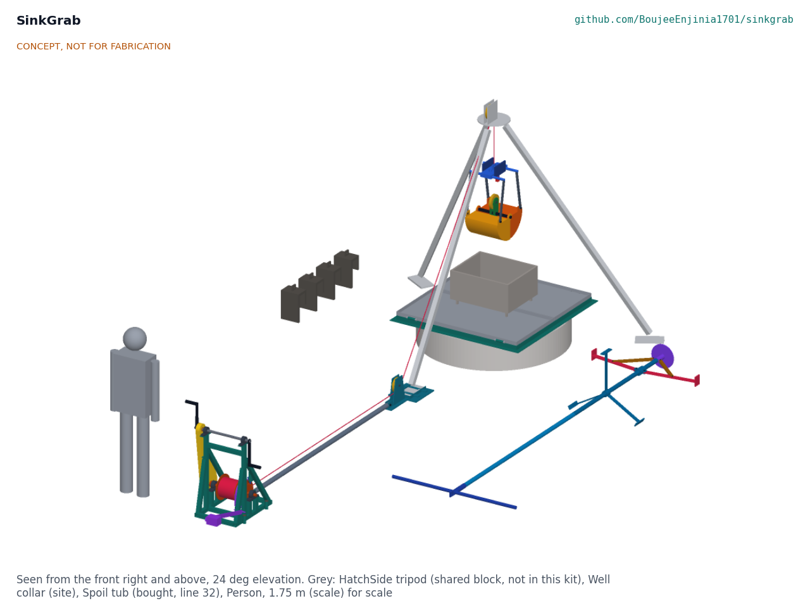

# SinkGrab design precis

Deepens village wells under water with a rope grab and under-curb scraper, without divers or pumps.

*Figure 1. SinkGrab at the well head: hand capstan, drawbar and lead cradle on the left, well-head frame with its doors closed, the grab at the dump position over a spoil tub, the scraper and ballast saddles on the ground. The HatchSide tripod is shown in grey. Concept, not for fabrication.*

## Summary

SinkGrab lets a village crew dig the last 3 m of a caisson well under water from the surface. A clamshell grab on one rope digs sand out of the flooded rings, an under-curb scraper on a pole cuts the soil from under the bottom ring so the lining sinks, and a hand capstan worked by two people does the lifting through the HatchSide tripod. On paper it lifts 21 L a bite with 52 N on each crank handle and never loads the tripod past its 150 kg rating; the cycle at 10 m is about 3.7 min, longer than the 3 min target. The parts cost about USD 2,506 against a value-engineering target of USD 4,000.

## How it works

The crew stands the HatchSide tripod over the well and replaces its winch with SinkGrab's line: an 8 mm rope runs from the hand capstan on the ground, through a lead sheave in a cradle under the tripod's leg A foot, up beside the leg, over the head sheave and straight down the well. A drawbar joins the capstan to the cradle, so the rope pull is carried inside the kit and the tripod sees the same loads as with its own winch.

The grab is lowered closed on the capstan's band brake. On the bottom the crew slacks the line by about 0.3 m: the grab's head settles under its own weight and pushes the two shells open into the sand. Cranking then pulls the crosshead up toward the head through a 2:1 tackle inside the grab, which closes the shells on a bite and lifts it. At the top the crew closes the well-head doors under the grab, lowers it into a spoil tub standing on them and slacks the line again: the shells open and the sand falls into the tub. Cranking closes the empty grab and lifts it off; the doors open and the cycle repeats.

When the centre has been dug about 330 mm below the cutting edge, the scraper goes down on 2 m pole sections. Its foot lands in the sump, the pole's weight slides it down through the foot sleeve, and two struts push two arms out until their toes reach 15 mm beyond the ring's outer face, under the cutting edge. Two people turn the pole with a T-bar through the hole in the closed doors, and the toes cut a ring of soil from under the wall, which the grab then removes. Lifting the pole folds the arms.

Every cycle the crew reads the dip tape at four datum holes on the well-head frame. If one side is ahead, they scrape only on the high side and hang ballast saddles on the high side of the top ring.

## Main components

*Table 1. Components (numbers are bill of materials lines).*

| # | Component | Role |
| --- | --- | --- |
| 1 to 7 | Hand capstan: frame, winding drum with brake drum and ratchet wheel, pawl, crank shaft with shear pin hub, removable cranks, chain guard, weighted band brake, stakes | Two-person hoist; holds the load at any depth, limits the line pull |
| 8, 9 | Foot cradle with lead sheave, and drawbar | Turns the line up leg A; carries the pull back to the capstan |
| 10 to 14 | Clamshell grab: head with ballast plates, tie rods, two shells, crosshead with hinge pin and sheave, shear link | Digs and lifts 21 L a bite under water on one line |
| 15 to 17 | Under-curb scraper head, 2 m pole sections, T-bar | Cuts the soil from under the ring's cutting edge |
| 18, 19 | Well-head frame with datum brackets, folding doors | Covers the shaft, carries the spoil tub, guides the pole, holds the tilt datum |
| 20 | Ballast saddles (8) | Add weight on the high side of the top ring |
| 21 to 34 | Bought: bearings, chain drive, shear pins, sheaves, ropes, swivel and shackles, dip tape and plumb line, gas detector, spoil tubs, barrier kit, fasteners | |

## Numbers from the TRL 3 calculations

*Table 2. First-order numbers (SKG-CAL-001).*

| Quantity | Value | Assumption or basis |
| --- | --- | --- |
| Bite | 21.2 L (28.3 L closed) | 75 % fill in loose saturated sand |
| Grab mass | 47.9 kg; 93 kg full in air | Sand 2.0 kg/L, 3 L of water |
| Working line pull | 1,006 N | 1.1 for hand hoisting |
| Crank force at rated load | 52 N each, two people | 4:1 chain, 250 mm cranks, outer layer |
| Hoist speed | 6.0 m/min | 50 W per person |
| Cycle at 10 m | 3.7 min (3.1 min with three at the cranks) | Lowering 0.5 m/s on the brake |
| Crank shear pin | Line limited to 2,107 N | 3 mm S235, ±20 % |
| Shear link | Releases at 1,202 to 1,469 N | Pin break-tested, ±10 % |
| Tripod | Inside its 150 kg rating and 225 kg proof | HatchSide HTS-CAL-001 |
| Scraper | 136 N each on the T-bar; arms fold to 364 mm radius | 150 N per toe in loose sand |
| Sinking | Continues while skin friction is below 1.66 kPa | 8-ring string, 8 saddles |
| Heaviest piece | 24.6 kg (scraper head) | Model masses |
| Parts cost | USD 2,506 | Value-engineering target USD 4,000 |

## Key design choices

All decided under Amish's pre-approvals of 2026-10-03 (SKG-DDR-001 and SKG-DDR-002).

- **One line does everything.** A two-line grab needs a second winch and two people keeping two ropes in step. SinkGrab's grab is lowered closed and opened by its own head weight, so one capstan and one rope dig, lift and dump.
- **The tripod never sees more than its rating.** A calibrated shear link at the grab's tackle releases between 1.20 and 1.47 kN and opens the grab if it snags; a 3 mm shear pin in the crank hub caps the line at 2.1 kN, under the tripod's proof load, whatever two people do at the cranks.
- **The rope pull stays inside the kit.** The drawbar between the capstan and the cradle under the leg A foot means nothing is anchored to the ground but the tripod's own feet.
- **The brake is on unless someone holds it off.** A weighted lever applies the band brake when it is let go; the cranks come off before any lowering.
- **The scraper is centred and opened by weight.** A pole with a centralizer reaches any depth to 25 m, and its own weight opens the arms only when the foot is on the sump floor.
- **Doors over the shaft.** The well is covered whenever the grab is up; the doors also carry the spoil tub, guide the pole and hold the tilt datum.

## Patent design-arounds

From the preliminary patent, trademark and prior-art screen (not legal advice):

- Rope grab and scraper only; no sand dredger or suction dredging, to stay clear of CN101787703B (China 22MCC Group, active to about 2030).
- A targeted search of Chinese open-caisson excavator patents for under-curb scraper claims is run before public release (decided, SKG-DDR-001, item 14).
- US1750728A (well-tool grab) is expired and a different tool; no constraint.

## Relationship to other lab projects

- **HatchSide** provides the tripod. SinkGrab removes the HatchSide winch, fits a 150 mm sheave grooved for its 8 mm line in the HatchSide head, and clamps its cradle under the leg A foot. Nothing in HatchSide is changed.
- **SiltHaul and SaltDrag** share the hand capstan block: the same frame layout, 4:1 chain, shear pin hub and pawl, here with a single drum and a band brake.
- **CalRig** is the first candidate rig for the proof loads.

## Safety

> **Safety:** SinkGrab is lifting equipment worked over an open well shaft, with a hand-cranked chain drive and loads hanging over the well. The hazards are falls into the shaft, loads or tools falling into the well or onto people, rope or pin failure, fingers and clothing caught in the chain, drum or brake, bad air in the shaft, and rings dropping or tilting suddenly as they are undercut.
>
> - Nobody enters the well while SinkGrab is in use. Any entry for another reason needs a gas test, a harness on a separate line from separate rescue equipment, and a person at the top throughout. SinkGrab's line is never used to lift or lower a person.
> - Test the shaft air with the four-gas detector before work starts each day and after any break. Never run a petrol or diesel engine in or near the well mouth.
> - The doors are closed whenever the grab is above them and at every stop. A barrier stands 2 m outside the tripod feet.
> - Every lifting part is proof-loaded before first use (SKG-BLD-001, section 6). Nobody stands under the grab or beside the line while it is loaded.
> - The shear pins are always the specified mild steel pins, never a bolt or a nail.
> - The cranks come off before lowering on the brake; the chain guard stays on.
> - Stop and correct when tilt passes 1 in 160; stop all undercutting at 1 in 80 until it is corrected.
>
> This design is published as an open engineering reference. It is not certified lifting or well-construction equipment.

## Open questions

The open questions of SKG-PRB-001 v0.1 were answered on paper at TRL 2 (SKG-DDR-001). What only trials can answer is listed in SKG-PRB-001, "Questions for the first trials". Three requirements await Amish's decision in the design decisions register (SKG-DEC-001): R1, R3 and R4.
